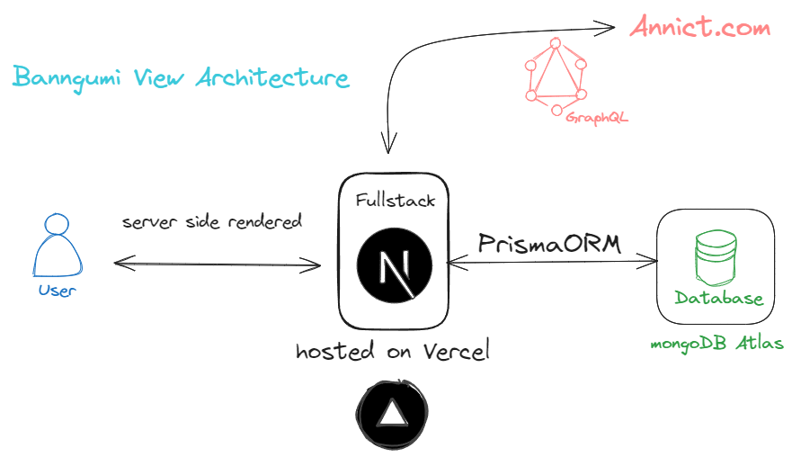

# Banngumi View

Banngumi View is a fullstack web application designed for anime enthusiasts, utilizing data provided by Annict. User can explore an extensive database of anime works, manage watchlist, track viewing progress, and engage with a vibrant community of fellow fans.


<p align="center">
  <a href="https://banngumi-view.vercel.app/">Live Demo</a>
</p>



## Features

- **Browse Anime Works**: Users can view a comprehensive list of anime works and search by Japanese titles.
- **Manage Watchlist**: Establish your anilist and share it with friends.
- **Responsive Design**: Support all devices from mobile up to 4K monitors.
- **OAuth**: No more forget password on websites.
- **Dark Mode Support**: 👀 are crucial.

## Tech Stack

- **[Next.js](https://nextjs.org/)**: Using App Directory, React Server Components, API Routes Handler.
- **[Tailwind CSS](https://tailwindcss.com)**: Styling, RWD, and dark mode toggle.
- **[GraphQL](https://graphql.org/)**: Query data from **[Annict.com](https://developers.annict.com/)** with desired data format.
- **[MongoDB](https://www.mongodb.com/)**, **[Prisma](https://www.prisma.io/)**: Storing user data in **Documents** format, and ORM makes interacting with database like a breeze.
- **[NextAuth.js](https://next-auth.js.org)**: OAuth sign in with GitHub/Google strategy.
- **[Redux Toolkit](https://redux-toolkit.js.org/)**: Manage application states on client side.

## Running Locally

Create a `.env` file following `.env.example`

```bash
git clone https://github.com/irigyano/Banngumi-View.git
cd banngumi-view
pnpm install
npx prisma generate
npx prisma db push
pnpm run dev
```

## Roadmap

- [ ] Replace Redux Toolkit with React Query
